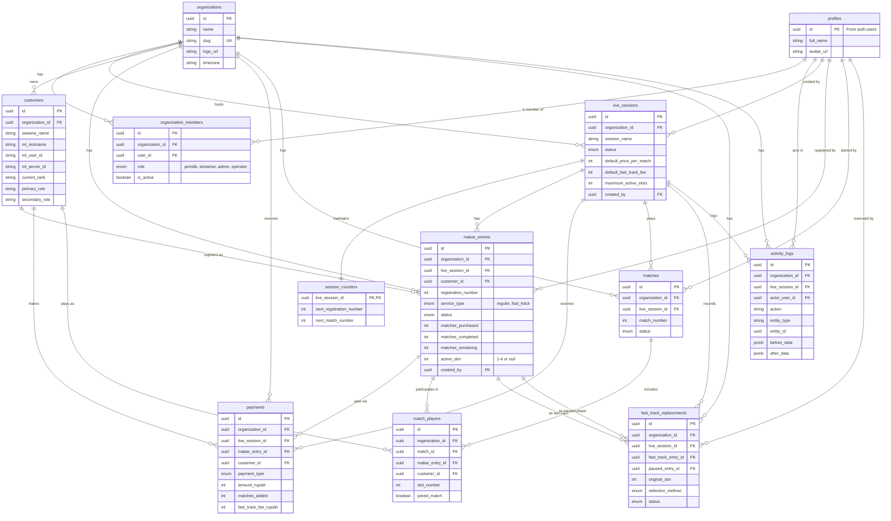

# Entity Relationship Diagram (ERD)

Berikut adalah visualisasi struktur tabel untuk Database Joka Joki.

```mermaid
erDiagram
    organizations ||--o{ organization_members : "has"
    profiles ||--o{ organization_members : "is member of"
    
    organizations ||--o{ live_sessions : "hosts"
    organizations ||--o{ customers : "owns"
    organizations ||--o{ mabar_entries : "has"
    organizations ||--o{ payments : "receives"
    organizations ||--o{ matches : "has"
    organizations ||--o{ fast_track_replacements : "has"
    organizations ||--o{ activity_logs : "has"

    live_sessions ||--|| session_counters : "maintains"
    live_sessions ||--o{ mabar_entries : "has"
    live_sessions ||--o{ payments : "receives"
    live_sessions ||--o{ matches : "plays"
    live_sessions ||--o{ fast_track_replacements : "records"
    live_sessions ||--o{ activity_logs : "logs"

    customers ||--o{ mabar_entries : "registers as"
    customers ||--o{ payments : "makes"
    customers ||--o{ match_players : "plays as"

    mabar_entries ||--o{ payments : "paid via"
    mabar_entries ||--o{ match_players : "participates in"
    
    mabar_entries ||--o{ fast_track_replacements : "as fast track"
    mabar_entries ||--o{ fast_track_replacements : "as paused player"

    matches ||--o{ match_players : "includes"
    
    profiles ||--o{ activity_logs : "acts in"
    profiles ||--o{ live_sessions : "created by"
    profiles ||--o{ mabar_entries : "registered by"
    profiles ||--o{ matches : "started by"
    profiles ||--o{ fast_track_replacements : "executed by"

    organizations {
        uuid id PK
        string name
        string slug UK
        string logo_url
        string timezone
    }

    profiles {
        uuid id PK "From auth.users"
        string full_name
        string avatar_url
    }

    organization_members {
        uuid id PK
        uuid organization_id FK
        uuid user_id FK
        enum role "pemilik, streamer, admin, operator"
        boolean is_active
    }

    live_sessions {
        uuid id PK
        uuid organization_id FK
        string session_name
        enum status
        int default_price_per_match
        int default_fast_track_fee
        int maximum_active_slots
        uuid created_by FK
    }

    session_counters {
        uuid live_session_id PK,FK
        int next_registration_number
        int next_match_number
    }

    customers {
        uuid id PK
        uuid organization_id FK
        string saweria_name
        string ml_nickname
        string ml_user_id
        string ml_server_id
        string current_rank
        string primary_role
        string secondary_role
    }

    mabar_entries {
        uuid id PK
        uuid organization_id FK
        uuid live_session_id FK
        uuid customer_id FK
        int registration_number
        enum service_type "reguler, fast_track"
        enum status
        int matches_purchased
        int matches_completed
        int matches_remaining
        int active_slot "1-4 or null"
        uuid created_by FK
    }

    payments {
        uuid id PK
        uuid organization_id FK
        uuid live_session_id FK
        uuid mabar_entry_id FK
        uuid customer_id FK
        enum payment_type
        int amount_rupiah
        int matches_added
        int fast_track_fee_rupiah
    }

    matches {
        uuid id PK
        uuid organization_id FK
        uuid live_session_id FK
        int match_number
        enum status
    }

    match_players {
        uuid id PK
        uuid organization_id FK
        uuid match_id FK
        uuid mabar_entry_id FK
        uuid customer_id FK
        int slot_number
        boolean joined_match
    }

    fast_track_replacements {
        uuid id PK
        uuid organization_id FK
        uuid live_session_id FK
        uuid fast_track_entry_id FK
        uuid paused_entry_id FK
        int original_slot
        enum selection_method
        enum status
    }

    activity_logs {
        uuid id PK
        uuid organization_id FK
        uuid live_session_id FK
        uuid actor_user_id FK
        string action
        string entity_type
        uuid entity_id
        jsonb before_data
        jsonb after_data
    }
```
